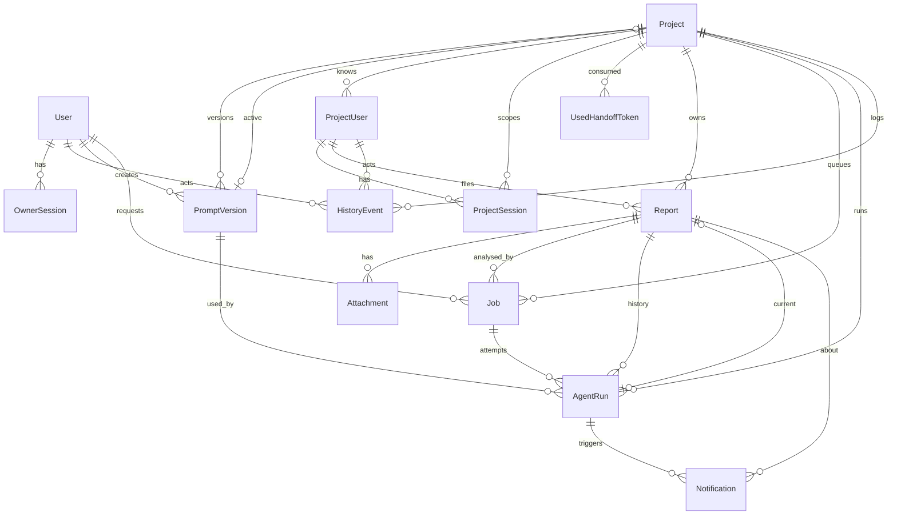

# 02 — Entities & Database Design

Status: **design v1, 2026-09-22 — nothing migrated yet.** This is the plan for the Prisma schema; the schema file will be written from it in `docs/plans/01-foundation.md`. Product context: [`PLAN.md`](../PLAN.md) (Russian), [01-idea.md](01-idea.md). Decisions referenced below live in [04-decisions.md](04-decisions.md).

## 0. Principles

1. **One schema, `projectId` everywhere.** Every project-scoped row carries `projectId`, even when it is reachable through another FK (Attachment → Report → Project). Guards filter by it directly, indexes start with it, and a missing filter is a one-line review finding instead of a join puzzle.
2. **Project = configuration row.** Connecting a project inserts one `Project` row (plus a `PromptVersion`). No DDL, no code.
3. **Two kinds of status, never mixed.** What the pipeline did (`Job.status`, `AgentRun.status`, `Report.analysisStatus`) vs what the owner did (`Report.triageStatus`).
4. **State changes and their side effects commit together.** Marking a run `DONE`, pointing `Report.currentRunId` at it, inserting the `Notification` row and the `HistoryEvent` is one transaction. A retry can replay a step, never duplicate an e-mail.
5. **Nothing personal or historical is hard-deleted.** Projects are archived, reports are triaged as archived, project users stay (reports reference them). Only expired sessions, used handoff tokens and old run logs are purged.
6. **Secrets never enter the database.** Columns that name a secret hold the *name of an env variable* (`repoAuthEnv`), never the value. Handoff verification keys are *public* keys and may be stored.
7. **Untrusted text is data.** `Report.title`, `description`, `fields`, attachment names come from external users. They are stored verbatim, escaped on render, and never concatenated into instructions.

Conventions (MAGSpace): Prisma, PostgreSQL 16, `cuid()` ids, `createdAt` / `updatedAt`, English `UPPER_SNAKE` enums mirrored in `packages/shared`, `///` doc comments in the schema, hand-written raw-SQL migrations for what Prisma cannot express (partial unique indexes, CHECK constraints).

## 1. Entity map

| Entity | Scope | Purpose |
|---|---|---|
| `User` | global | Owner account (Google sign-in, allowlist in env). Actor of owner actions. |
| `OwnerSession` | global | DB-backed cookie session of an owner. |
| `AppSetting` | global | Runtime settings the owner edits in the cabinet (concurrency, retention, mail sender). |
| `Project` | — | A connected project: repo, agent, auth adapter, forms, recipients, limits. |
| `PromptVersion` | project | Immutable versions of the project's brief and preset overrides; `Project.activePromptVersionId` points at the live one. |
| `ProjectUser` | project | Identity cache of a connected project's user as seen through handoff tokens. Rate limits, blocking, "who reported". |
| `ProjectSession` | project | DB-backed cookie session of a reporter / project admin. |
| `UsedHandoffToken` | project | `jti` of consumed handoff tokens — replay protection. |
| `Report` | project | A bug or an idea: core columns + self-describing field snapshot + reporter snapshot + two statuses. |
| `Attachment` | project | Files of a report; DB holds the storage key only. |
| `Job` | project | Queue row for the worker: one analysis request (initial or rerun), with attempts, backoff, heartbeat. |
| `AgentRun` | project | One execution of the agent for a job: provider, model, prompt versions, commit, usage, cost, result, log. |
| `Notification` | project | One outgoing message (e-mail) about a run; unique per (run, kind, channel, recipient). |
| `HistoryEvent` | global / project | Audit log: who did what to which entity, JSON payload with the diff. |



## 2. Enums

| Enum | Values | Notes |
|---|---|---|
| `OwnerRole` | `OWNER` | One value today; the column exists so a read-only `VIEWER` is an enum addition, not a schema redesign. |
| `ProjectStatus` | `ACTIVE`, `PAUSED`, `ARCHIVED` | `PAUSED`: forms refuse new reports, queued jobs wait. `ARCHIVED`: sessions revoked, queued jobs cancelled, everything read-only. |
| `RunnerMode` | `SHARED`, `DEDICATED` | Which runner container serves the project's workspace. |
| `ReportKind` | `BUG`, `IDEA` | Selects the form, the preset, the result schema and the model. |
| `AnalysisStatus` | `QUEUED`, `RUNNING`, `DONE`, `FAILED` | Denormalised on `Report` from the latest job so lists need no join. |
| `TriageStatus` | `NEW`, `SEEN`, `IN_PROGRESS`, `HANDLED`, `ARCHIVED` | The owner's own state. |
| `JobType` | `ANALYZE` | Only one type in v1; the enum keeps the queue generic (later: `REPO_CHECK`, `TEST_RUN`). |
| `JobStatus` | `QUEUED`, `RUNNING`, `DONE`, `FAILED`, `CANCELLED` | |
| `RunStatus` | `RUNNING`, `DONE`, `FAILED`, `TIMEOUT`, `CANCELLED` | `FAILED` = provider error or invalid result; `TIMEOUT` = killed by the runner or declared dead by the sweeper. |
| `NotificationKind` | `ANALYSIS_DONE`, `ANALYSIS_FAILED` | `REPORT_RECEIVED` (before analysis) is deliberately not in v1 — the cabinet's `NEW` badge covers it. |
| `NotificationChannel` | `EMAIL` | Telegram / Slack are later values. |
| `NotificationStatus` | `PENDING`, `SENT`, `FAILED` | |
| `Operation` | `OWNER_LOGIN`, `SETTING_UPDATE`, `PROJECT_CREATE`, `PROJECT_UPDATE`, `PROJECT_STATUS`, `PROMPT_VERSION_CREATE`, `PROMPT_VERSION_ACTIVATE`, `PROJECT_USER_BLOCK`, `PROJECT_USER_UNBLOCK`, `REPORT_CREATE`, `REPORT_TRIAGE`, `REPORT_RERUN`, `JOB_CANCEL` | Audit operations. |

## 3. Entities in detail

### 3.1 `User` — owner account

| Field | Type | Notes |
|---|---|---|
| `id` | cuid | |
| `email` | String, unique, lower-case | Must be in `ADMIN_EMAILS` at sign-in time; the row is created on first successful login (JIT). Env is the allowlist, the row is the identity for FKs. |
| `name` | String? | From Google profile. |
| `role` | `OwnerRole` = `OWNER` | |
| `isActive` | Boolean = true | Removing an address from env *and* flipping this off both block sign-in; the row stays for history. |
| `lastLoginAt` | DateTime? | |
| `createdAt`, `updatedAt` | | |

### 3.2 `OwnerSession`

`id` cuid (the cookie value) · `userId` FK → User (cascade) · `expiresAt` · `userAgent?` · `ip?` · `createdAt`. Index `userId`. Short TTL (8 h, sliding) — the cabinet shows every project's code fragments.

### 3.3 `AppSetting`

`key` String @id · `value` Json · `updatedAt` · `updatedById?` FK → User. Keys in v1: `maxConcurrentRuns` (global, default 1), `logRetentionDays` (default 90), `mailFrom`, `defaultTimezone` (`Europe/Warsaw`). Rule of thumb: runtime knobs the owner turns in the cabinet → `AppSetting`; infrastructure and secrets → env.

### 3.4 `Project` — the configuration row

One wide row: typed columns for everything the worker, runner and guards query; JSONB for adapter-, provider- and form-specific structure, each validated by a zod schema in `packages/shared`.

| Group | Field | Type | Notes |
|---|---|---|---|
| identity | `slug` | String, unique | `magguarantee`; part of every URL. |
| | `name` | String | |
| | `codePrefix` | String, unique | `MAGG` → reports shown as `MAGG-42`, e-mail subject `[MAGG][bug] #42`. |
| | `status` | `ProjectStatus` | |
| | `timezone` | String = `Europe/Warsaw` | For "per day" limits and e-mail date formatting. |
| | `formLocale` | String = `pl` | Default UI language of the project's forms. |
| | `reportLocale` | String = `ru` | Language the agent writes the report in. |
| repo | `repoUrl` | String | |
| | `repoDefaultBranch` | String = `main` | |
| | `repoSubpath` | String? | `magguarantee-app/` — where the code lives inside a monorepo. |
| | `repoAuthEnv` | String? | **Name** of the env variable holding the deploy key / token. Null = public repo. |
| | `repoReadFirst` | String[] | Files the agent is told to read first: `CLAUDE.md`, `docs/INDEX.md`. |
| agent | `providerKey` | String = `claude-code` | Key of a provider registered in code. |
| | `modelBug`, `modelIdea` | String | Model ids per report kind (may be equal). |
| | `effort` | String? | Provider-specific effort level, if supported. |
| | `maxTurns` | Int | |
| | `timeoutSec` | Int | Hard cap enforced by the runner; the sweeper uses `timeoutSec + grace`. |
| | `budgetUsd` | Decimal(10,2) | Per run. |
| | `toolProfile` | String = `read-only` | Named tool allow-list defined in code. |
| | `providerConfig` | Json | Extras the provider understands (e.g. extra allowed tools, CLI flags). |
| | `runnerMode` | `RunnerMode` = `SHARED` | |
| prompts | `activePromptVersionId` | String?, unique, FK → PromptVersion | Pointer to the live brief. Null only between project creation and the first version. |
| access | `authAdapter` | String = `handoff-jwt` | Key of an adapter registered in code. |
| | `authConfig` | Json | Per adapter. For `handoff-jwt`: `issuer`, `publicKeys: [{kid, pem, notBefore?}]` (list → key rotation without downtime), `reporterRoles[]` (`*` = any), `adminRoles[]`, `adminSubs[]`, `adminEmails[]`, `sessionTtlMin`. |
| forms | `formConfig` | Json | `{ bug: { fields: FieldDef[] }, idea: { fields: FieldDef[] }, dictionaries: {...} }`. `FieldDef = { key, type, required, labels: {pl, en, ru}, options?, dictionary? }`. `title` and `description` are implicit and always present. |
| mail | `notificationConfig` | Json | `{ bug: { to: [] }, idea: { to: [] }, failed: { to: [] }, subjectPrefix? }`. |
| limits | `limits` | Json | `{ reportsPerUserPerDay, maxAttachments, maxAttachmentBytes, allowedMimeTypes[] }`. |
| counters | `reportCounter` | Int = 0 | Per-project report number sequence (see 4.1). |
| | `createdAt`, `updatedAt` | | |

Why not a `ProjectConfig` sub-table per group: nothing queries the groups independently, the row is read whole by the worker, and one row keeps "connect a project = one insert" literally true. If a group ever needs history, `HistoryEvent` already records every change with a diff.

### 3.5 `PromptVersion`

| Field | Type | Notes |
|---|---|---|
| `id` | cuid | |
| `projectId` | FK → Project | |
| `version` | Int | Per project, unique `(projectId, version)`, assigned as max+1 in a transaction. |
| `brief` | String | What the agent is told about the project: what it is, where things are, glossary, what not to do. |
| `bugOverride`, `ideaOverride` | String? | Replacements / additions to the base presets for this project. |
| `note` | String? | Why this version exists ("told it to ignore the orchestrator agent"). |
| `createdById` | FK → User? | |
| `createdAt` | | |

Rows are immutable. Editing in the cabinet creates a new row; **activation** is a pointer move on `Project`, so rollback is the same operation. Base presets (bug / idea) are files in git; a run records which base version it used as a string (`basePresetVersion`).

### 3.6 `ProjectUser` — external identity cache

| Field | Type | Notes |
|---|---|---|
| `id` | cuid | |
| `projectId` | FK → Project | |
| `externalId` | String | The token's `sub`. Unique `(projectId, externalId)`. |
| `email`, `name` | String? | Latest values from the token. |
| `roles` | String[] | Latest values from the token — **the project is the source of truth**, overwritten on every handoff. |
| `locale` | String? | From the token; picks the form language. |
| `isBlocked` | Boolean = false | Owner action. Blocking deletes the user's sessions in the same transaction. |
| `blockedReason` | String? | |
| `firstSeenAt`, `lastSeenAt` | DateTime | |
| `createdAt`, `updatedAt` | | |

Why a table instead of columns on `Report`: per-user rate limits need a stable key, the owner needs to block a spammer, and the cabinet wants "all reports by this carrier". The same person in two projects is two rows — there is no global identity by design (privacy, and roles differ per project).

### 3.7 `ProjectSession`

`id` cuid (cookie value) · `projectId` FK · `projectUserId` FK → ProjectUser (cascade) · `expiresAt` · `userAgent?` · `ip?` · `createdAt`. Indexes `projectUserId`, `(projectId, expiresAt)`. TTL from `authConfig.sessionTtlMin` (default 480). Guards read roles and `isBlocked` from `ProjectUser` at request time (one join), so blocking and role changes take effect immediately, not at expiry.

### 3.8 `UsedHandoffToken`

`id` cuid · `projectId` FK · `jti` String · `expiresAt` DateTime · `createdAt`. Unique `(projectId, jti)`; index `expiresAt` for the purge. The insert happens inside the verification transaction; a unique violation **is** the replay detection. Rows older than their `expiresAt` are deleted nightly — a token cannot be replayed after it expired anyway.

### 3.9 `Report`

| Group | Field | Type | Notes |
|---|---|---|---|
| identity | `id` | cuid | |
| | `projectId` | FK → Project | |
| | `number` | Int | Per project; unique `(projectId, number)`. Displayed as `<codePrefix>-<number>`. |
| | `clientRequestId` | String? | UUID generated by the form; unique `(projectId, clientRequestId)` — a double submit becomes a no-op returning the existing report. |
| content | `kind` | `ReportKind` | |
| | `title` | String | Core column: lists, search, e-mail subject. |
| | `description` | String | Core column: the free text. |
| | `fields` | Json | Self-describing snapshot `[{ key, label, type, value }]` of every other field of the project's form at submission time. Old reports render without the form config. |
| | `locale` | String? | Language of the text (for the agent prompt). |
| | `targetRef` | String? | Branch / tag to analyse; null = project default. |
| reporter | `projectUserId` | FK → ProjectUser (restrict) | |
| | `reporterEmail`, `reporterName` | String? | Snapshot at submission — `ProjectUser` changes later. |
| | `reporterRoles` | String[] | Snapshot; the role matters for the analysis (MAGGuarantee behaves per role). |
| pipeline | `analysisStatus` | `AnalysisStatus` = `QUEUED` | Mirrors the latest job. |
| | `currentRunId` | String?, unique, FK → AgentRun | Latest **successful** run. History stays in `AgentRun`. |
| owner | `triageStatus` | `TriageStatus` = `NEW` | |
| | `ownerNote` | String? | |
| | `triagedById` | FK → User? | |
| | `triagedAt` | DateTime? | |
| | `createdAt`, `updatedAt` | | |

Indexes: `(projectId, createdAt desc)` · `(projectId, kind)` · `(projectId, analysisStatus)` · `(projectId, triageStatus)` · `(triageStatus, createdAt desc)` for the cross-project feed · `(projectUserId, createdAt)` for rate limits. Full-text search on `title` / `description` (`tsvector`, raw migration) is a later addition if the feed's filter is not enough.

### 3.10 `Attachment`

`id` cuid · `projectId` FK · `reportId` FK → Report (cascade) · `storageKey` String unique · `fileName` · `mimeType` · `sizeBytes` Int · `sha256` String? · `width?`, `height?` Int (images) · `createdAt`. Index `reportId`.

Storage layout: `<projectId>/<reportId>/<attachmentId>.<ext>` on a volume the runner mounts read-only (S3-compatible later; the code talks to a storage interface, the DB only knows keys). Uploaded in the same multipart request as the form (decision 2026-09-22), so an attachment always has a report and orphans cannot exist.

### 3.11 `Job` — the queue

| Field | Type | Notes |
|---|---|---|
| `id` | cuid | |
| `projectId` | FK → Project | |
| `reportId` | FK → Report | Required in v1 (only `ANALYZE` jobs exist). |
| `type` | `JobType` = `ANALYZE` | |
| `status` | `JobStatus` = `QUEUED` | |
| `priority` | Int = 0 | Ideas from the boss can be bumped; higher first. |
| `attempt` | Int = 0 | Incremented on dequeue. |
| `maxAttempts` | Int = 2 | Infrastructure failures retry; result-schema failures do not (see 4.5). |
| `runAfter` | DateTime = now | Backoff target after a failed attempt. |
| `lockedAt`, `lockedBy` | DateTime?, String? | Worker id that holds it. |
| `heartbeatAt` | DateTime? | Updated by the worker every 30 s while running. |
| `options` | Json? | Rerun overrides: `{ model?, promptVersionId?, targetRef?, effort? }`. |
| `lastError` | String? | Short error code + message; the long story is in `AgentRun`. |
| `requestedById` | FK → User? | Null = created automatically with the report; set for reruns. |
| `createdAt`, `updatedAt`, `finishedAt?` | | |

Indexes: `(status, runAfter, priority desc, createdAt)` for dequeue · `reportId` · `(projectId, status)`. **Raw-SQL migration:** `CREATE UNIQUE INDEX job_one_running_per_project ON "Job" ("projectId") WHERE status = 'RUNNING';` — this index *is* the "one analysis per project at a time" rule (4.3).

### 3.12 `AgentRun`

| Group | Field | Type | Notes |
|---|---|---|---|
| identity | `id` | cuid | |
| | `projectId`, `reportId`, `jobId` | FKs | A job with retries has several runs; `jobId` is indexed, not unique. |
| | `status` | `RunStatus` | |
| what ran | `providerKey`, `model`, `effort?`, `toolProfile` | String | Effective values after job overrides. |
| | `promptVersionId` | FK → PromptVersion? (restrict) | The project brief version used. |
| | `basePresetVersion` | String | `bug@3` — from the preset file header / git. |
| | `resultSchemaVersion` | String | `bug-result@1`. |
| | `promptSnapshot` | String? | The assembled prompt (system + task, without attachments). 10–50 KB; what the preset-designer needs to reproduce a run. |
| | `repoRef`, `repoCommit` | String, String? | What was analysed. |
| timing | `startedAt`, `finishedAt?`, `durationMs?` | | |
| usage | `inputTokens`, `outputTokens`, `cacheReadTokens`, `cacheWriteTokens`, `numTurns` | Int? | From the provider's usage output. |
| | `costUsd` | Decimal(10,4)? | |
| | `stopReason` | String? | Provider's reason: done / max turns / budget / timeout. |
| result | `resultJson` | Json? | Raw JSON returned by the agent (kept even when invalid, for debugging). |
| | `resultValid` | Boolean = false | Passed the result schema. |
| | `resultMd` | String? | Markdown rendered by the backend from a valid `resultJson`. |
| | `repairAttempted` | Boolean = false | A second provider call asked to fix the JSON (4.5). |
| | `error` | String? | |
| log | `log` | String? | Raw provider transcript. Nulled after `logRetentionDays`. |
| | `logBytes` | Int? | Kept after purge, so the cabinet can say "log purged, was 2.3 MB". |
| | `logPurgedAt` | DateTime? | |
| | `logStorageKey` | String? | Reserved: if logs ever move to file storage, this replaces `log` without a schema change. |
| | `createdAt` | | |

Indexes: `(reportId, startedAt desc)` · `(projectId, startedAt)` for monthly cost · `status` · `jobId`.

### 3.13 `Notification`

`id` · `projectId` FK · `reportId` FK · `runId` FK → AgentRun? · `kind` · `channel` · `recipient` String · `status` = `PENDING` · `attempts` Int = 0 · `providerMessageId?` · `error?` · `sentAt?` · `createdAt`, `updatedAt`. **Unique `(runId, kind, channel, recipient)`.** The row is inserted in the transaction that finishes the run; a mailer loop sends `PENDING` rows and marks them `SENT`. A crash between the SMTP call and the update re-sends once on restart (at-least-once). Exactly-once would need provider idempotency keys — not worth it for one owner mailbox.

### 3.14 `HistoryEvent` — audit

`id` · `groupId` String (one user action = one group) · `actorUserId?` FK → User · `actorProjectUserId?` FK → ProjectUser · `projectId?` FK → Project · `operation` `Operation` · `entityType` String · `entityId` String · `payload` Json · `createdAt`. Indexes `(entityType, entityId)`, `(projectId, createdAt)`, `createdAt`. CHECK (raw migration): not both actors set. Payload for `PROJECT_UPDATE` is `{ changed: { field: { from, to } } }` with secret-bearing fields reduced to `{ changed: true }`.

## 4. Scenarios — how the schema behaves

### 4.1 A carrier files a bug (happy path)

1. `POST /p/magguarantee/reports` (multipart: fields + up to `limits.maxAttachments` files). Guard: `ProjectSession` valid → `ProjectUser` not blocked → role ∈ `authConfig.reporterRoles` → project `ACTIVE`.
2. Validate body against `formConfig.bug`; validate files (count, size, MIME). Reject before touching storage.
3. Rate limit: `COUNT(Report) WHERE projectUserId = ? AND createdAt >= <start of today in project.timezone>` < `limits.reportsPerUserPerDay`.
4. Write files to storage under a temp prefix.
5. One transaction: `UPDATE "Project" SET "reportCounter" = "reportCounter" + 1 WHERE id = ? RETURNING "reportCounter"` (row lock → gap-free numbers per project) · insert `Report` (`fields` snapshot built from `formConfig` labels, reporter snapshot from `ProjectUser`, `analysisStatus = QUEUED`) · insert `Attachment` rows · insert `Job` (`QUEUED`) · insert `HistoryEvent` (`REPORT_CREATE`, actor = project user).
6. After commit: move files from the temp prefix to `<projectId>/<reportId>/…`. On any failure before commit: delete the temp files; nothing in the DB.
7. Response: `{ code: "MAGG-42" }`. No e-mail yet — the cabinet feed shows the `NEW` badge.

Double click → the same `clientRequestId` → unique violation caught → return the existing report.

### 4.2 Handoff: replay, expiry, wrong audience

`GET /p/magguarantee/auth/callback?token=…`: parse header `kid` → pick the key from `authConfig.publicKeys` → verify signature (algorithm pinned to ES256) → check `iss = slug`, `aud = bugbot`, `exp` within 60 s + 30 s skew → transaction: insert `UsedHandoffToken (projectId, jti, exp)` (unique violation = replay → 401) · upsert `ProjectUser` (roles, email, name, locale overwritten; `lastSeenAt`) · if `isBlocked` → 403 · insert `ProjectSession` → set cookie → redirect to `/p/magguarantee/alarm` or `/ideas` (from the token's `kind` claim or a query parameter). Failures are application logs, not `HistoryEvent` rows — bots retrying an expired link must not be able to grow the audit table.

### 4.3 Two workers, two reports of one project

Worker dequeue (single statement, `READ COMMITTED`):

```sql
WITH candidate AS (
  SELECT j.id FROM "Job" j JOIN "Project" p ON p.id = j."projectId"
  WHERE j.status = 'QUEUED' AND j."runAfter" <= now() AND p.status = 'ACTIVE'
    AND NOT EXISTS (SELECT 1 FROM "Job" r WHERE r."projectId" = j."projectId" AND r.status = 'RUNNING')
  ORDER BY j.priority DESC, j."createdAt"
  LIMIT 1 FOR UPDATE OF j SKIP LOCKED
)
UPDATE "Job" SET status = 'RUNNING', "lockedAt" = now(), "lockedBy" = $1,
                 "heartbeatAt" = now(), attempt = attempt + 1
WHERE id = (SELECT id FROM candidate) RETURNING *;
```

The `NOT EXISTS` check is not serialisable: two workers can pass it for two different jobs of the same project in the same instant. The partial unique index `job_one_running_per_project` turns the loser's `UPDATE` into a unique violation; the worker catches it and dequeues again. The runner additionally holds a lock file per workspace — belt and braces, because a `git checkout` under a running analysis would be silent corruption of the result.

Global concurrency = number of worker loops, from `AppSetting.maxConcurrentRuns`; different projects run in parallel up to that number.

### 4.4 Worker crashes mid-run

The job stays `RUNNING` with a stale `heartbeatAt`. A sweeper (every minute) selects `RUNNING` jobs with `heartbeatAt < now() - (project.timeoutSec + 120 s)`: the open `AgentRun` → `TIMEOUT`; if `attempt < maxAttempts` → job `QUEUED`, `runAfter = now() + 5 min · attempt`, `lockedBy = null`; else job `FAILED`, `Report.analysisStatus = FAILED`, `Notification (ANALYSIS_FAILED)` to `notificationConfig.failed.to`. The runner, on its next start, finds the workspace lock file with a dead pid and removes it.

### 4.5 The agent returns garbage

`AgentRun.resultJson` gets the raw output, `resultValid = false`. The worker makes **one** repair call (same run, `repairAttempted = true`, usage added to the run): "here is your output, here are the schema errors, return only corrected JSON". Valid → continue as success. Still invalid → run `FAILED` with `error = RESULT_SCHEMA`, and the job goes `FAILED` **without** a retry — the same prompt will produce the same failure; the owner reruns manually after the preset-designer looks at `promptSnapshot` and `log`. Infrastructure errors (`REPO_UNREACHABLE`, `PROVIDER_5XX`, `TIMEOUT`) do retry.

### 4.6 Success and the "current" run

One transaction: `AgentRun.status = DONE`, `resultMd` rendered, `Report.currentRunId = run.id`, `Report.analysisStatus = DONE`, `Job.status = DONE`, `Notification (ANALYSIS_DONE)` rows for every recipient of the report's kind, `HistoryEvent` if the run was a rerun. **Latest successful run wins** as the current one; earlier runs stay in history and the cabinet can show two side by side. (Alternative considered: the owner picks the current run by hand — more clicks for a rare need; revisit if reruns become routine.)

### 4.7 The owner reruns with another model

Cabinet action → insert `Job` (`type = ANALYZE`, `options = { model: "…" }`, `requestedById = owner`) + `HistoryEvent (REPORT_RERUN)`; `Report.analysisStatus = QUEUED`. Refused (409) if the report already has a `QUEUED` or `RUNNING` job. The run records the effective `model` and `promptVersionId` from the options.

### 4.8 The form changes after 200 reports exist

`formConfig` gets a new field, an old one is removed. Old reports keep rendering from their `fields` snapshot (labels included); new reports use the new form; no migration, no null explosion. The agent prompt is built from the snapshot too, so a report always carries what the reporter actually saw.

### 4.9 Prompt rollback

The owner edits the brief → new `PromptVersion` (`version = max + 1`) → `PROMPT_VERSION_CREATE` → activate → `Project.activePromptVersionId` moves → `PROMPT_VERSION_ACTIVATE`. Rollback = activate an older version. Every run knows which version it used; "since which version did bug reports get worse" is a query.

### 4.10 Project paused / archived

`PAUSED`: `POST reports` → 409 with a project-language message; dequeue skips the project (`p.status = 'ACTIVE'`); sessions stay valid; the cabinet shows the backlog. `ARCHIVED`: same plus one transaction that deletes `ProjectSession` rows and sets `QUEUED` jobs to `CANCELLED`; reports and runs stay readable; the handoff callback refuses new sign-ins. Hard delete of a project exists only as a dev script that runs the cascade in the right order.

### 4.11 Blocking a spammer

`ProjectUser.isBlocked = true` + `blockedReason` + delete their `ProjectSession` rows + `HistoryEvent (PROJECT_USER_BLOCK)` in one transaction. The next handoff still verifies (the project does not know) but ends in 403. Their existing reports stay.

### 4.12 Roles change on the project side

Nothing to do in BugBot: the next handoff overwrites `ProjectUser.roles`; guards read roles live from `ProjectUser`, so an admin demoted in MAGGuarantee loses the ideas page as soon as they sign in again, and immediately if the owner blocks them meanwhile. `Report.reporterRoles` keeps what they were when they reported.

### 4.13 Key rotation on the project side

The project adds a second key pair and starts signing with `kid = 2`; the owner adds `{kid: "2", pem}` to `authConfig.publicKeys` before that (order matters: BugBot first, then the project). Tokens with `kid = 1` keep verifying until the owner removes the old entry. No downtime, no schema.

### 4.14 Attachments reach the agent

The job payload lists storage keys; the runner copies the files into a per-run temp directory **outside** the git workspace (a dirty `git status` would leak into the analysis) and passes the paths to the provider as image inputs when the provider supports them (`providerConfig.acceptsImages`). Nothing in the DB changes; only the storage layout has to be stable — it is, keys never change.

### 4.15 Monthly cost per project

`SELECT "projectId", date_trunc('month', "startedAt"), SUM("costUsd"), SUM("inputTokens" + "outputTokens") FROM "AgentRun" GROUP BY 1, 2` on the `(projectId, startedAt)` index. Cabinet tiles come from this; no materialised table until it is slow.

### 4.16 Nightly housekeeping

One cron: delete `OwnerSession` / `ProjectSession` / `UsedHandoffToken` rows past `expiresAt`; `UPDATE "AgentRun" SET log = NULL, "logPurgedAt" = now() WHERE "finishedAt" < now() - interval '<logRetentionDays> days' AND log IS NOT NULL`. Reports, results, attachments and usage are never purged (decision 2026-09-22).

## 5. Integrity rules outside Prisma (raw-SQL migration)

| Rule | Mechanism |
|---|---|
| One `RUNNING` job per project | `CREATE UNIQUE INDEX job_one_running_per_project ON "Job" ("projectId") WHERE status = 'RUNNING'` |
| Job attempts bounded | `CHECK (attempt <= "maxAttempts")` |
| Report numbers positive | `CHECK (number > 0)` |
| History event has at most one actor | `CHECK (NOT ("actorUserId" IS NOT NULL AND "actorProjectUserId" IS NOT NULL))` |
| Current run belongs to the same report | enforced in the service (the pointer is set only from the run's own transaction); a trigger is possible if it ever bites |

## 6. Deletion and cascade policy

| Parent → child | On delete |
|---|---|
| User → OwnerSession | cascade |
| User → HistoryEvent, PromptVersion, Job, Report (triagedBy) | set null (actor columns are nullable; history survives an owner's removal) |
| Project → anything | **restrict** — projects are archived, not deleted |
| ProjectUser → ProjectSession | cascade |
| ProjectUser → Report | restrict |
| Report → Attachment | cascade (dev-only path; reports are not deleted in production) |
| Report → Job, AgentRun, Notification | restrict |
| Job → AgentRun | restrict |
| PromptVersion → AgentRun | restrict (a run must always be reproducible) |

## 7. Prisma schema — v1 draft

Not final; the foundation plan turns it into `apps/api/prisma/schema.prisma` plus the raw-SQL migration of §5. Written here so the review happens on the real shape.

```prisma
generator client {
  provider = "prisma-client-js"
}

datasource db {
  provider = "postgresql"
  url      = env("DATABASE_URL")
}

enum OwnerRole { OWNER }
enum ProjectStatus { ACTIVE PAUSED ARCHIVED }
enum RunnerMode { SHARED DEDICATED }
enum ReportKind { BUG IDEA }
enum AnalysisStatus { QUEUED RUNNING DONE FAILED }
enum TriageStatus { NEW SEEN IN_PROGRESS HANDLED ARCHIVED }
enum JobType { ANALYZE }
enum JobStatus { QUEUED RUNNING DONE FAILED CANCELLED }
enum RunStatus { RUNNING DONE FAILED TIMEOUT CANCELLED }
enum NotificationKind { ANALYSIS_DONE ANALYSIS_FAILED }
enum NotificationChannel { EMAIL }
enum NotificationStatus { PENDING SENT FAILED }
enum Operation {
  OWNER_LOGIN SETTING_UPDATE
  PROJECT_CREATE PROJECT_UPDATE PROJECT_STATUS
  PROMPT_VERSION_CREATE PROMPT_VERSION_ACTIVATE
  PROJECT_USER_BLOCK PROJECT_USER_UNBLOCK
  REPORT_CREATE REPORT_TRIAGE REPORT_RERUN JOB_CANCEL
}

/// Owner account. Sign-in = Google id_token + e-mail in ADMIN_EMAILS; the row is created on first login.
model User {
  id            String         @id @default(cuid())
  email         String         @unique
  name          String?
  role          OwnerRole      @default(OWNER)
  isActive      Boolean        @default(true)
  lastLoginAt   DateTime?
  createdAt     DateTime       @default(now())
  updatedAt     DateTime       @updatedAt
  sessions      OwnerSession[]
  historyEvents HistoryEvent[]
  promptVersions PromptVersion[]
  requestedJobs Job[]
  triagedReports Report[]
  settings      AppSetting[]
}

model OwnerSession {
  id        String   @id @default(cuid())
  userId    String
  user      User     @relation(fields: [userId], references: [id], onDelete: Cascade)
  expiresAt DateTime
  userAgent String?
  ip        String?
  createdAt DateTime @default(now())
  @@index([userId])
}

model AppSetting {
  key         String   @id
  value       Json
  updatedAt   DateTime @updatedAt
  updatedById String?
  updatedBy   User?    @relation(fields: [updatedById], references: [id], onDelete: SetNull)
}

/// A connected project. One row = one project; JSON columns are validated by zod schemas in packages/shared.
model Project {
  id                    String         @id @default(cuid())
  slug                  String         @unique
  name                  String
  codePrefix            String         @unique
  status                ProjectStatus  @default(ACTIVE)
  timezone              String         @default("Europe/Warsaw")
  formLocale            String         @default("pl")
  reportLocale          String         @default("ru")
  repoUrl               String
  repoDefaultBranch     String         @default("main")
  repoSubpath           String?
  /// NAME of the env variable holding the deploy key / token — never the value.
  repoAuthEnv           String?
  repoReadFirst         String[]
  providerKey           String         @default("claude-code")
  modelBug              String
  modelIdea             String
  effort                String?
  maxTurns              Int            @default(60)
  timeoutSec            Int            @default(900)
  budgetUsd             Decimal        @default(5) @db.Decimal(10, 2)
  toolProfile           String         @default("read-only")
  providerConfig        Json           @default("{}")
  runnerMode            RunnerMode     @default(SHARED)
  authAdapter           String         @default("handoff-jwt")
  authConfig            Json
  formConfig            Json
  notificationConfig    Json
  limits                Json
  reportCounter         Int            @default(0)
  activePromptVersionId String?        @unique
  activePromptVersion   PromptVersion? @relation("ProjectActivePrompt", fields: [activePromptVersionId], references: [id], onDelete: SetNull)
  promptVersions        PromptVersion[] @relation("ProjectPromptVersions")
  users                 ProjectUser[]
  sessions              ProjectSession[]
  usedHandoffTokens     UsedHandoffToken[]
  reports               Report[]
  attachments           Attachment[]
  jobs                  Job[]
  runs                  AgentRun[]
  notifications         Notification[]
  historyEvents         HistoryEvent[]
  createdAt             DateTime       @default(now())
  updatedAt             DateTime       @updatedAt
}

/// Immutable. Editing creates a new version; Project.activePromptVersionId selects the live one.
model PromptVersion {
  id           String     @id @default(cuid())
  projectId    String
  project      Project    @relation("ProjectPromptVersions", fields: [projectId], references: [id])
  version      Int
  brief        String
  bugOverride  String?
  ideaOverride String?
  note         String?
  createdById  String?
  createdBy    User?      @relation(fields: [createdById], references: [id], onDelete: SetNull)
  createdAt    DateTime   @default(now())
  activeFor    Project?   @relation("ProjectActivePrompt")
  runs         AgentRun[]
  @@unique([projectId, version])
}

/// A connected project's user as seen through handoff tokens. The project is the source of truth for roles.
model ProjectUser {
  id            String           @id @default(cuid())
  projectId     String
  project       Project          @relation(fields: [projectId], references: [id])
  externalId    String
  email         String?
  name          String?
  roles         String[]
  locale        String?
  isBlocked     Boolean          @default(false)
  blockedReason String?
  firstSeenAt   DateTime         @default(now())
  lastSeenAt    DateTime         @default(now())
  createdAt     DateTime         @default(now())
  updatedAt     DateTime         @updatedAt
  sessions      ProjectSession[]
  reports       Report[]
  historyEvents HistoryEvent[]
  @@unique([projectId, externalId])
  @@index([projectId, email])
}

model ProjectSession {
  id            String      @id @default(cuid())
  projectId     String
  project       Project     @relation(fields: [projectId], references: [id])
  projectUserId String
  projectUser   ProjectUser @relation(fields: [projectUserId], references: [id], onDelete: Cascade)
  expiresAt     DateTime
  userAgent     String?
  ip            String?
  createdAt     DateTime    @default(now())
  @@index([projectUserId])
  @@index([projectId, expiresAt])
}

/// Replay protection: the insert inside the verification transaction fails on a reused jti.
model UsedHandoffToken {
  id        String   @id @default(cuid())
  projectId String
  project   Project  @relation(fields: [projectId], references: [id])
  jti       String
  expiresAt DateTime
  createdAt DateTime @default(now())
  @@unique([projectId, jti])
  @@index([expiresAt])
}

/// A bug or an idea. Core columns + self-describing `fields` snapshot + reporter snapshot + two statuses.
model Report {
  id              String         @id @default(cuid())
  projectId       String
  project         Project        @relation(fields: [projectId], references: [id])
  number          Int
  clientRequestId String?
  kind            ReportKind
  title           String
  description     String
  fields          Json
  locale          String?
  targetRef       String?
  projectUserId   String
  projectUser     ProjectUser    @relation(fields: [projectUserId], references: [id])
  reporterEmail   String?
  reporterName    String?
  reporterRoles   String[]
  analysisStatus  AnalysisStatus @default(QUEUED)
  currentRunId    String?        @unique
  currentRun      AgentRun?      @relation("ReportCurrentRun", fields: [currentRunId], references: [id], onDelete: SetNull)
  triageStatus    TriageStatus   @default(NEW)
  ownerNote       String?
  triagedById     String?
  triagedBy       User?          @relation(fields: [triagedById], references: [id], onDelete: SetNull)
  triagedAt       DateTime?
  attachments     Attachment[]
  jobs            Job[]
  runs            AgentRun[]     @relation("ReportRuns")
  notifications   Notification[]
  createdAt       DateTime       @default(now())
  updatedAt       DateTime       @updatedAt
  @@unique([projectId, number])
  @@unique([projectId, clientRequestId])
  @@index([projectId, createdAt(sort: Desc)])
  @@index([projectId, kind])
  @@index([projectId, analysisStatus])
  @@index([projectId, triageStatus])
  @@index([triageStatus, createdAt(sort: Desc)])
  @@index([projectUserId, createdAt])
}

model Attachment {
  id         String   @id @default(cuid())
  projectId  String
  project    Project  @relation(fields: [projectId], references: [id])
  reportId   String
  report     Report   @relation(fields: [reportId], references: [id], onDelete: Cascade)
  storageKey String   @unique
  fileName   String
  mimeType   String
  sizeBytes  Int
  sha256     String?
  width      Int?
  height     Int?
  createdAt  DateTime @default(now())
  @@index([reportId])
}

/// Queue row. Partial unique index (raw migration) enforces one RUNNING job per project.
model Job {
  id            String    @id @default(cuid())
  projectId     String
  project       Project   @relation(fields: [projectId], references: [id])
  reportId      String
  report        Report    @relation(fields: [reportId], references: [id])
  type          JobType   @default(ANALYZE)
  status        JobStatus @default(QUEUED)
  priority      Int       @default(0)
  attempt       Int       @default(0)
  maxAttempts   Int       @default(2)
  runAfter      DateTime  @default(now())
  lockedAt      DateTime?
  lockedBy      String?
  heartbeatAt   DateTime?
  options       Json?
  lastError     String?
  requestedById String?
  requestedBy   User?     @relation(fields: [requestedById], references: [id], onDelete: SetNull)
  runs          AgentRun[]
  createdAt     DateTime  @default(now())
  updatedAt     DateTime  @updatedAt
  finishedAt    DateTime?
  @@index([status, runAfter, priority(sort: Desc), createdAt])
  @@index([reportId])
  @@index([projectId, status])
}

/// One execution of the agent. Everything needed to reproduce and to bill.
model AgentRun {
  id                  String         @id @default(cuid())
  projectId           String
  project             Project        @relation(fields: [projectId], references: [id])
  reportId            String
  report              Report         @relation("ReportRuns", fields: [reportId], references: [id])
  jobId               String
  job                 Job            @relation(fields: [jobId], references: [id])
  status              RunStatus      @default(RUNNING)
  providerKey         String
  model               String
  effort              String?
  toolProfile         String
  promptVersionId     String?
  promptVersion       PromptVersion? @relation(fields: [promptVersionId], references: [id])
  basePresetVersion   String
  resultSchemaVersion String
  promptSnapshot      String?
  repoRef             String
  repoCommit          String?
  startedAt           DateTime       @default(now())
  finishedAt          DateTime?
  durationMs          Int?
  inputTokens         Int?
  outputTokens        Int?
  cacheReadTokens     Int?
  cacheWriteTokens    Int?
  numTurns            Int?
  costUsd             Decimal?       @db.Decimal(10, 4)
  stopReason          String?
  resultJson          Json?
  resultValid         Boolean        @default(false)
  resultMd            String?
  repairAttempted     Boolean        @default(false)
  error               String?
  log                 String?
  logBytes            Int?
  logPurgedAt         DateTime?
  logStorageKey       String?
  currentFor          Report?        @relation("ReportCurrentRun")
  notifications       Notification[]
  createdAt           DateTime       @default(now())
  @@index([reportId, startedAt(sort: Desc)])
  @@index([projectId, startedAt])
  @@index([status])
  @@index([jobId])
}

/// Outgoing message about a run. Unique per (run, kind, channel, recipient) = no duplicate e-mails.
model Notification {
  id                String              @id @default(cuid())
  projectId         String
  project           Project             @relation(fields: [projectId], references: [id])
  reportId          String
  report            Report              @relation(fields: [reportId], references: [id])
  runId             String?
  run               AgentRun?           @relation(fields: [runId], references: [id])
  kind              NotificationKind
  channel           NotificationChannel @default(EMAIL)
  recipient         String
  status            NotificationStatus  @default(PENDING)
  attempts          Int                 @default(0)
  providerMessageId String?
  error             String?
  sentAt            DateTime?
  createdAt         DateTime            @default(now())
  updatedAt         DateTime            @updatedAt
  @@unique([runId, kind, channel, recipient])
  @@index([status, createdAt])
}

/// Audit log. One user action = one groupId spanning several events. At most one actor (CHECK in raw migration).
model HistoryEvent {
  id                 String       @id @default(cuid())
  groupId            String
  actorUserId        String?
  actorUser          User?        @relation(fields: [actorUserId], references: [id], onDelete: SetNull)
  actorProjectUserId String?
  actorProjectUser   ProjectUser? @relation(fields: [actorProjectUserId], references: [id], onDelete: SetNull)
  projectId          String?
  project            Project?     @relation(fields: [projectId], references: [id])
  operation          Operation
  entityType         String
  entityId           String
  payload            Json
  createdAt          DateTime     @default(now())
  @@index([entityType, entityId])
  @@index([projectId, createdAt])
  @@index([createdAt])
}
```

## 8. What was considered and rejected

| Option | Why not |
|---|---|
| Per-project tables / schemas | DDL per project, N× migrations, no cross-project feed (decision 2026-09-22). |
| One `Session` table with two nullable subject columns | Two guards with different lifetimes and cookies; two tables make a cross-use impossible by construction. |
| Storing the project's own JWT secret to verify its tokens | Symmetric secret in BugBot's DB = forgeable sign-ins on a leak; and the project's cookie is not visible cross-domain anyway. |
| Computing "current run" by query instead of `Report.currentRunId` | Works, but every feed row would need a lateral join; the pointer is set in the same transaction and costs nothing. |
| A `Draft` entity for pre-uploaded attachments | Not needed with single-request submit (decision 2026-09-22). |
| `REPORT_RECEIVED` e-mail | The cabinet's `NEW` badge is the inbox; an e-mail per submission would double the noise. Easy to add as a `NotificationKind` later. |
| Global identity across projects for the same e-mail | Privacy and role semantics differ per project; the owner can still search by e-mail in the feed. |
| BullMQ / Redis | Extra service; per-project serialisation would be hand-rolled anyway; Postgres does it with one partial index (decision 2026-09-22). |

## 9. Open points (not blocking the foundation plan)

- Default `limits` for MAGGuarantee: `reportsPerUserPerDay = 5`, `maxAttachments = 5`, `maxAttachmentBytes = 10 MB`, images + PDF only — confirm.
- Report code format `MAGG-42` — confirm the prefix and whether ideas get a separate prefix (`MAGG-I-7`) or share the sequence (current design: shared).
- `TriageStatus.IN_PROGRESS` — keep or drop to the four states of PLAN.md §9.2.
- Whether the owner should be able to hand-pick the current run instead of "latest successful wins" (4.6).
- Owner cabinet UI language (Russian assumed; not a DB question).
